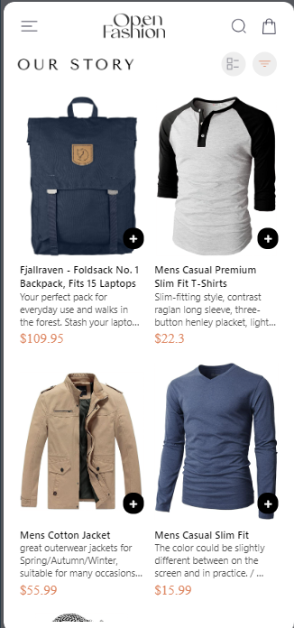
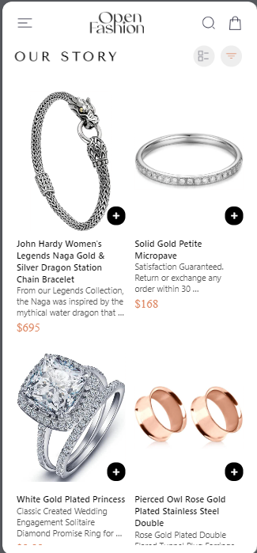
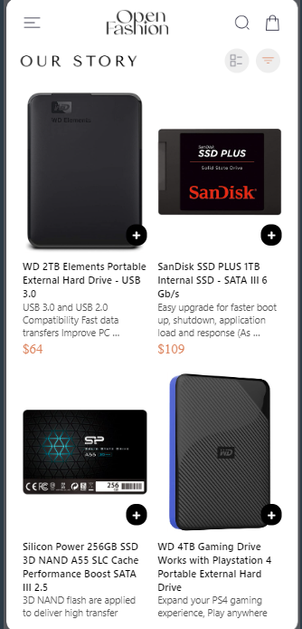
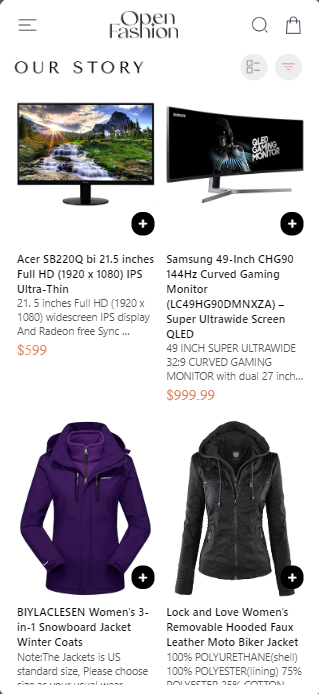
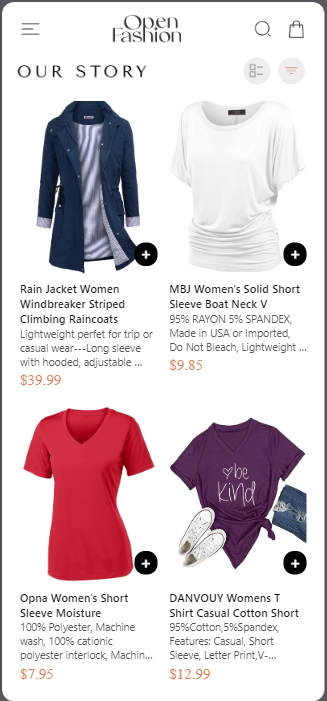
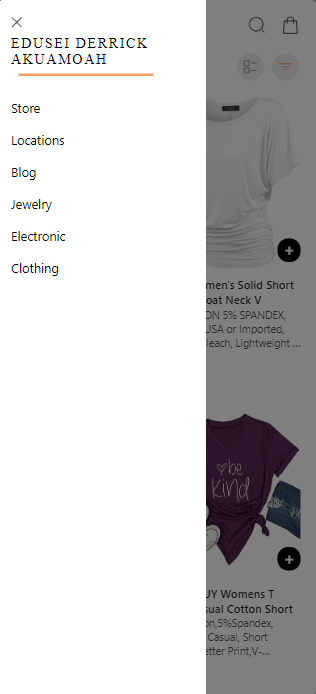
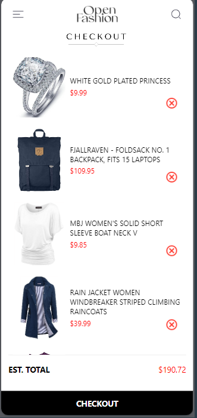

## ID_STUDENT: 11115682

  ## Design Choices and  Screenshots of the app
  
1.  Drawer Menu Implementation
Package Choice: The react-native-drawer-layout package is selected for its simplicity and efficiency in creating drawer layouts. It offers a flexible and user-friendly API for incorporating a side menu.
Drawer Structure: The drawer's content is designed to mirror the structure in the provided image. It includes sections for Store, Locations, Blog, Jewellery, Electronic, and Clothing, each represented by a TouchableOpacity component for interaction.
Header Layout: The header includes a menu button to open the drawer, a logo, and additional icons for search and cart navigation. This reflects a common mobile app design pattern, providing easy access to key navigation features.
2. Product Listing and Navigation
FlatList for Products: The FlatList component is used to display products in a two-column grid, ensuring a clean and organized presentation of product images and details.
Product Details Navigation: Each product in the list is wrapped in a TouchableOpacity component. Tapping a product navigates to the ProductDetailScreen, passing the product details and the addToCart function as parameters.
3. Data Storage
AsyncStorage for Persistence: AsyncStorage is used to persist cart data, allowing cart items to be saved across app sessions. This enhances the user experience by ensuring the cart contents are retained when the app is closed and reopened.
Loading Cart Data: On component mount, the cart data is loaded from AsyncStorage using the useEffect hook, initializing the cart state with any previously saved items.
Updating Cart Data: When a product is added to the cart, the addToCart function updates the local state and saves the new cart data to AsyncStorage, ensuring the cart remains up-to-date and changes are persistent.
   ## Screenshots of the app 

